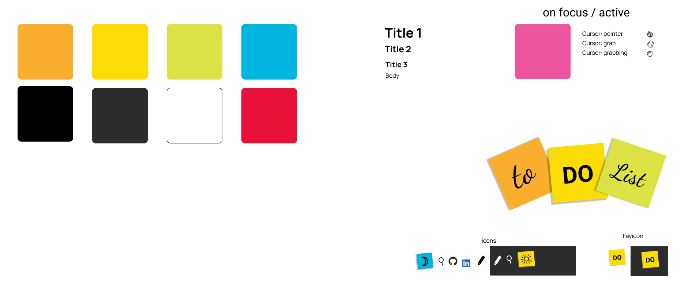
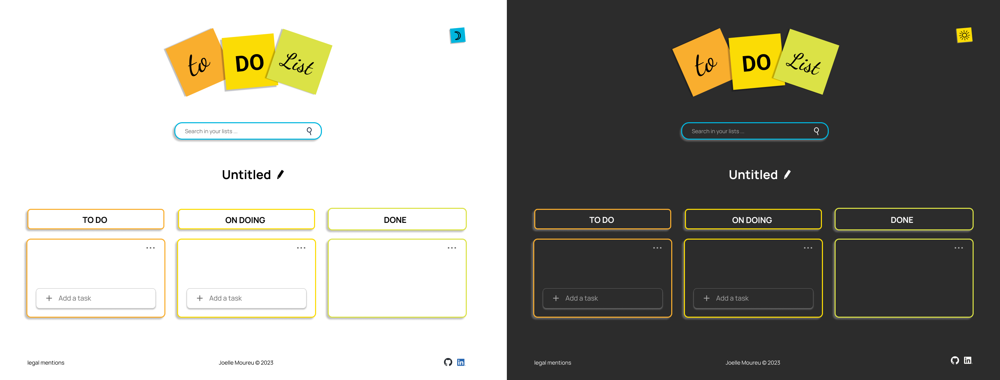
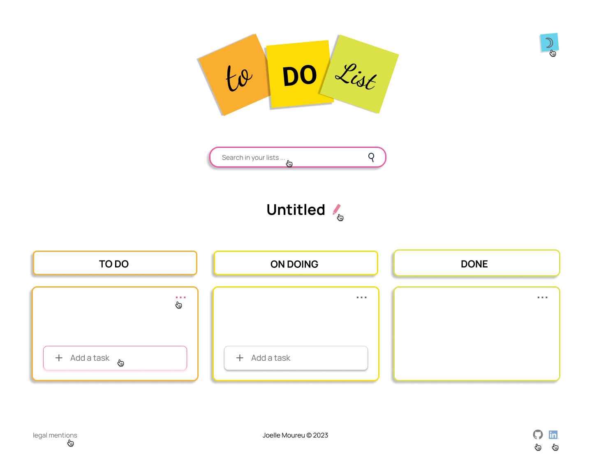
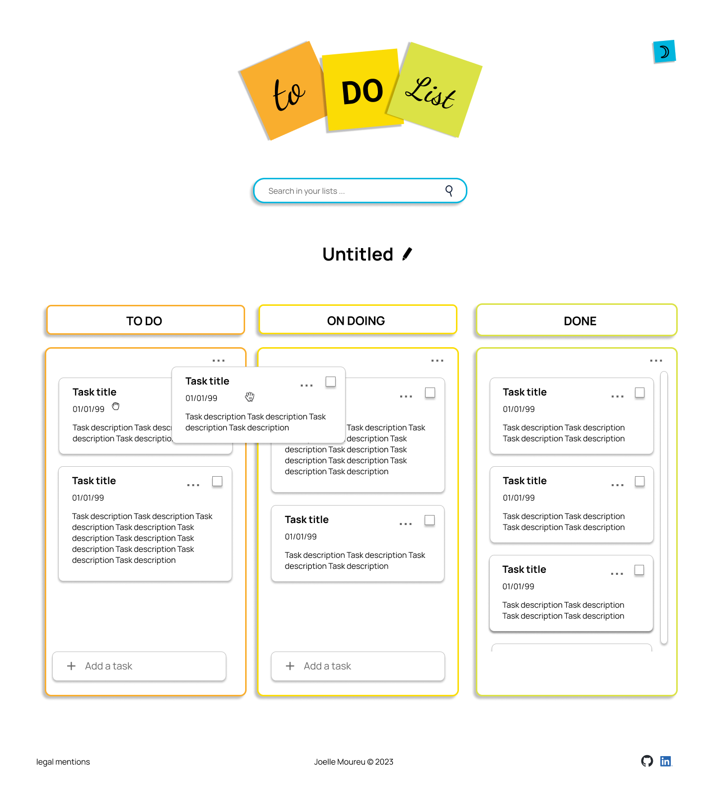
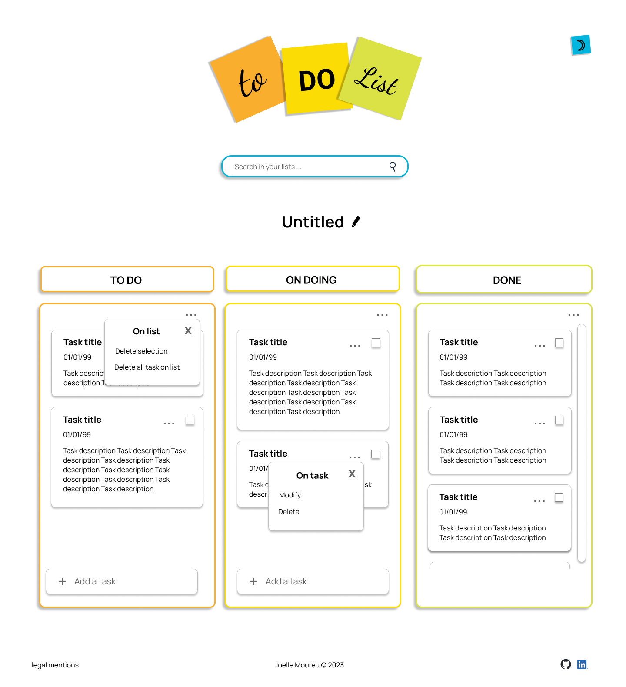
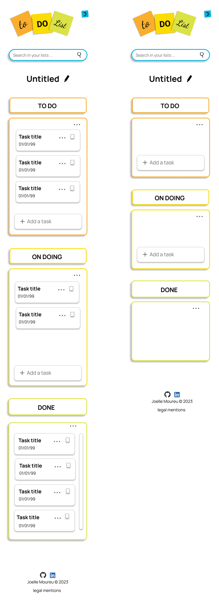

# 06-lab-js-todo_project

This project is an exercise for learning done during the formation with onlineformapro to become a web Developer.

In the <a href="https://github.com/JoeWebDev70/06-lab-js-todo">readme</a> you could find instructions on how to make it.
 

## Project description

### Features :

 - dark/light mode with preferred color scheme
 - word search with input search
 - drag-and-drop tasks
 - add new task
 - filter tasks by TODO - ON GOING - DONE
 - delete a task, several tasks, all tasks from a list
 

### Structure :

	1 PAGE (HML : dark/light mode / input search)
		1 ARRAY (DIV -- TEMPLATE -- LIST: named by user)  
	 		3 OBJECTS : TODO - ON GOING - DONE (SUB-LISTS : add new, delete (with option = selected task [check box] / all tasks)
				TASKS (draggable) 
					* title
					* options : delete / modify
					* description
					* due date
 

### Technologies :

 - Webpack
 - Babel
 - Sass
 - JS
 -----------
 - Localstorage
 - Template
 

## Figma modeling

Access to the <a href="https://www.figma.com/file/Dvkq07lxpUSzG8DBKEnOer/06-lab-js-todo?type=design&node-id=33%3A150&mode=design&t=6TwZkSokPvFsnLSO-1">figma</a> file.

### Download the figma file
<a href="./figma/06-lab-js-todo.fig">06-lab-js-todo.fig</a>
 

### Graphic identity

 

### Desktop

 

### Active

 

### Lists

 

### Options

 

### Responsive

 
